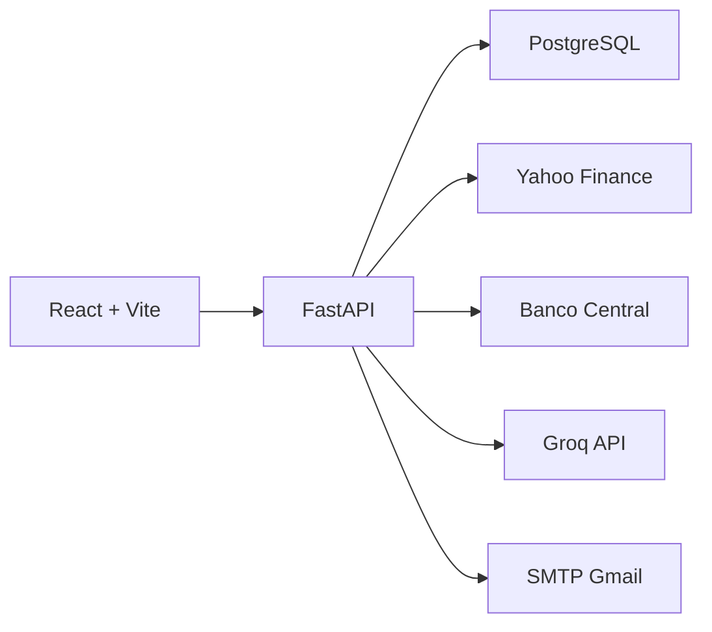

# 🚀 Vitta AI

<div align="center">

### 📈 Plataforma Inteligente para Análise de Ações e Investimentos

Análise de ativos • Simulações • IA Financeira • Alertas • Dashboard em Tempo Real


</div>

---

## ✨ Sobre o Projeto

O **Vitta AI** é uma plataforma web para análise de ações, simulação de investimentos e acompanhamento financeiro utilizando dados reais de mercado.

A aplicação combina:

- 🤖 Inteligência Artificial
- 📊 Indicadores financeiros
- 📈 Dados reais de mercado
- 🔔 Sistema de alertas
- 💼 Gestão de carteira
- 🧠 Assistente financeiro conversacional

> ⚠️ As análises possuem caráter informativo e não constituem recomendação de investimento.

---

# 🔐 Autenticação e Perfil

### Recursos disponíveis

✅ Cadastro de usuários

✅ Login persistente

✅ Recuperação de senha por e-mail

✅ Alteração de senha

✅ Perfil de risco

✅ Preferências de notificação

✅ Sessões seguras com Bearer Token

---

# 📊 Dashboard

O painel principal exibe:

- 💰 Patrimônio total
- 📈 Rentabilidade
- 🏦 Saldo disponível
- 📊 Distribuição da carteira
- 🇧🇷 Indicadores do mercado brasileiro
- 🔒 Modo privacidade

---

# 📈 Análise de Ações

### Informações disponíveis

- 🔍 Busca por ticker
- 📊 Histórico de preços
- 📉 Volatilidade
- 📦 Volume negociado
- 💵 Dividend Yield
- 🤖 Análise por IA
- 💬 Assistente conversacional

---

# ⚖️ Comparador de Ativos

Compare dois ativos simultaneamente:

- 📈 Crescimento
- 📉 Volatilidade
- 💰 Dividendos
- 📊 Performance histórica
- 🧠 Resumo gerado por IA

---

# 🧪 Simulador de Investimentos

Permite realizar projeções utilizando dados históricos reais.

### Métricas

- 💵 Valor investido
- 📈 Rentabilidade
- 🎯 Retorno estimado
- 📊 Evolução temporal

---

# 🔔 Sistema de Alertas

### Funcionalidades

✅ Alertas por preço

✅ Alertas por variação percentual

✅ Histórico de notificações

✅ Persistência em banco

---

# 🧠 Inteligência Artificial

O Vitta AI utiliza:

- 🚀 Groq API
- 🦜 LangChain
- 🌎 Tradução automática
- 💬 Chat financeiro contextual

---

## 🏗️ Arquitetura



## 🛠️ Tecnologias

### 🎨 Frontend

- ⚛️ React 19
- ⚡ Vite 8
- 🎨 Tailwind CSS 4
- 📡 Axios
- 📊 Recharts
- 🎯 Lucide React

### ⚙️ Backend

- 🐍 Python 3.11
- ⚡ FastAPI
- 🐘 PostgreSQL
- 📈 yFinance
- 🦜 LangChain
- 🚀 Groq API

### ☁️ Infraestrutura

- 🐳 Docker
- 🐳 Docker Compose
- ☁️ Cloud Ready

🔒 Segurança

✅ PBKDF2-SHA256

✅ Tokens hash SHA-256

✅ Sessões expiráveis

✅ Guardrails para IA

✅ Variáveis de ambiente

## 📄 Direitos Autorais

© 2026 Rennan Cardoso. Todos os direitos reservados.

Este projeto é proprietário e não pode ser copiado, modificado ou distribuído sem autorização prévia.

<div align="center">
💙 Desenvolvido com tecnologia para simplificar investimentos

Vitta AI

</div> ```
