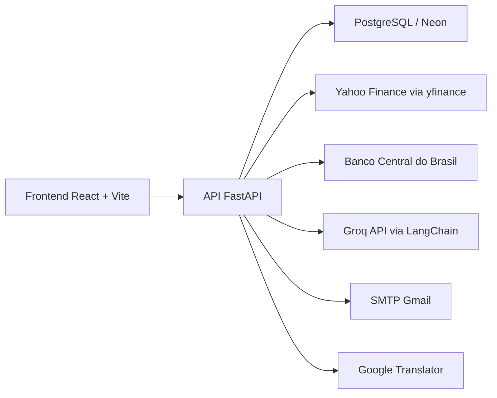

# Vitta AI

Plataforma web para análise de ações, simulação de investimentos e acompanhamento financeiro com dados reais de mercado. O projeto combina uma interface React com uma API FastAPI, autenticação persistente, histórico individual por usuário e recursos de IA para apoiar a leitura dos ativos.

> As análises são informativas e não constituem recomendação de investimento.

## Funcionalidades

### Autenticação e perfil

- Cadastro e login com sessão persistida no banco de dados.
- Senhas protegidas com PBKDF2-SHA256 e migração automática de senhas legadas após um login válido.
- Tokens de sessão enviados como Bearer Token e armazenados no banco somente em formato hash.
- Logout com revogação da sessão atual.
- Solicitação de redefinição de senha por e-mail.
- Redefinição por token temporário com expiração.
- Alteração de senha dentro da área autenticada.
- Perfil real do usuário com nome, telefone, perfil de risco e preferências de notificação.

### Dashboard

- Resumo patrimonial do usuário autenticado.
- Saldo disponível, valor investido, rendimento e distribuição da carteira.
- Cotações atuais dos ativos presentes na carteira.
- Indicadores reais de IBOVESPA e Selic.
- Modo de privacidade para ocultar valores sensíveis na interface.
- Carteira inicial vazia, sem posições fictícias.

### Análise de ações

- Busca por ticker, incluindo ativos brasileiros e internacionais.
- Cotação atual, variação, volume, máxima, mínima e histórico de preços.
- Tradução de informações do ativo quando disponível.
- Análise inteligente com IA.
- Assistente conversacional para perguntas financeiras relacionadas ao ativo.
- Registro da atividade no histórico do usuário.

### Comparador

- Comparação entre dois ativos com dados reais.
- Evolução histórica alinhada por data.
- Indicadores como crescimento, volatilidade e dividend yield.
- Resumo comparativo persistido no histórico individual.

### Simulador

- Simulação de investimento por ticker, valor inicial e período.
- Evolução estimada com base no histórico real do ativo.
- Valor final, lucro, rentabilidade e métricas de desempenho.
- Registro da simulação no histórico do usuário.

### Tendências

- Leitura quantitativa de tendência geral do mercado.
- Score baseado em momentum e volatilidade.
- Evolução temporal do índice de tendência.
- Análise por setor.
- Lista de ativos em alta, estáveis e em baixa.
- Probabilidades consolidadas para apoio à interpretação do cenário.

### Alertas

- Criação e exclusão de alertas persistentes por usuário.
- Alertas por preço-alvo ou variação percentual.
- Notificações recentes armazenadas no banco.
- Atualização periódica enquanto a tela de alertas estiver aberta.

### Histórico

- Timeline individual de análises, comparações e simulações.
- Filtros por tipo de atividade.
- Contadores e ranking dos tickers mais analisados.
- Dados derivados das ações reais executadas pelo usuário.

## Arquitetura



## Tecnologias

### Frontend

| Tecnologia | Uso |
| --- | --- |
| React 19 | Interface e componentes |
| Vite 8 | Ambiente de desenvolvimento e build |
| Tailwind CSS 4 | Estilização |
| Axios | Comunicação com a API |
| Recharts | Gráficos financeiros |
| Lucide React | Ícones |
| React Markdown | Renderização das respostas da IA |
| ESLint | Análise estática |

### Backend

| Tecnologia | Uso |
| --- | --- |
| Python 3.11 | Runtime da API |
| FastAPI | API REST |
| Uvicorn | Servidor ASGI |
| Pydantic | Validação dos dados |
| PostgreSQL | Persistência |
| Databases | Acesso assíncrono ao banco |
| yfinance | Cotações e histórico do Yahoo Finance |
| LangChain + LangChain Groq | Orquestração do assistente |
| Groq API | Modelos de linguagem |
| Deep Translator | Tradução de conteúdo |
| python-dotenv | Carregamento das variáveis de ambiente |

### Infraestrutura

- Docker e Docker Compose.
- Imagens base `python:3.11-slim` e `node:20-alpine`.
- PostgreSQL compatível com o schema de autenticação utilizado pelo projeto.

## Fontes de dados

| Fonte | Dados utilizados |
| --- | --- |
| Yahoo Finance | Cotações, candles históricos, volume e informações dos ativos |
| Banco Central do Brasil | Taxa Selic pela série SGS 432 |
| Groq | Respostas do assistente e análises textuais |
| Google Translator | Tradução de textos quando disponível |

Caso uma tradução falhe, o backend mantém o texto original. A disponibilidade das cotações também depende dos serviços externos.

## Estrutura do projeto

```text
.
|-- backend/
|   |-- auth.py              # autenticação, perfil e recuperação de senha
|   |-- auth_security.py     # hash de senha, tokens e expiração
|   |-- chatbot.py           # assistente com IA
|   |-- database.py          # conexão assíncrona com PostgreSQL
|   |-- features.py          # comparador, simulador, tendências, alertas e histórico
|   |-- main.py              # aplicação FastAPI e dashboard
|   |-- market.py            # integrações e cálculos de mercado
|   |-- prompts.py           # prompts das análises
|   |-- security.py          # guardrails de entrada
|   |-- storage.py           # tabelas e persistência da aplicação
|   |-- Dockerfile
|   `-- requirements.txt
|-- frontend/
|   |-- src/
|   |   |-- components/      # telas e componentes React
|   |   |-- api.js           # cliente Axios autenticado
|   |   |-- App.jsx          # navegação e sessão no cliente
|   |   `-- main.jsx
|   |-- Dockerfile
|   `-- package.json
|-- docker-compose.yaml
|-- .env.example
`-- README.md
```

## Configuração

### Pré-requisitos

- Docker Desktop com Docker Compose.
- Uma instância PostgreSQL/Neon compatível com o schema de autenticação do projeto.
- Uma chave da Groq API.
- Uma conta Gmail com senha de app para envio dos e-mails de recuperação, caso esse fluxo seja utilizado.

### Variáveis de ambiente

Crie o arquivo `.env` na raiz a partir do modelo:

```powershell
Copy-Item .env.example .env
```

Preencha as variáveis:

| Variável | Obrigatória | Descrição |
| --- | --- | --- |
| `DATABASE_URL` | Sim | URL de conexão PostgreSQL |
| `GROQ_API_KEY` | Sim | Chave da Groq API |
| `FRONTEND_URL` | Sim | Origem liberada pelo CORS |
| `VITE_API_URL` | Sim | URL pública da API consumida pelo frontend |
| `GMAIL_EMAIL` | Para reset por e-mail | Conta remetente |
| `GMAIL_APP_PASSWORD` | Para reset por e-mail | Senha de app do Gmail |

Não versione o arquivo `.env`.

## Executando com Docker

Suba os serviços:

```powershell
docker compose up -d --build
```

Acompanhe o backend:

```powershell
docker compose logs -f backend
```

Confira os contêineres:

```powershell
docker compose ps
```

Pare o ambiente:

```powershell
docker compose down
```

Serviços disponíveis:

| Serviço | URL |
| --- | --- |
| Frontend | [http://localhost:5173](http://localhost:5173) |
| API | [http://localhost:8000](http://localhost:8000) |
| Swagger | [http://localhost:8000/docs](http://localhost:8000/docs) |

## Executando localmente

### Backend

```powershell
cd backend
python -m venv .venv
.\.venv\Scripts\Activate.ps1
pip install -r requirements.txt
uvicorn main:app --reload --port 8000
```

### Frontend

Em outro terminal:

```powershell
cd frontend
npm install
npm run dev
```

## Endpoints principais

### Autenticação

| Método | Rota | Descrição |
| --- | --- | --- |
| `POST` | `/auth/cadastro` | Cria uma conta |
| `POST` | `/auth/login` | Inicia uma sessão |
| `POST` | `/auth/logout` | Revoga a sessão atual |
| `POST` | `/auth/solicitar-reset` | Envia o link de redefinição |
| `POST` | `/auth/resetar-senha` | Redefine a senha pelo token |
| `POST` | `/auth/alterar-senha` | Troca a senha autenticada |
| `GET` | `/auth/profile` | Consulta o perfil |
| `PUT` | `/auth/profile` | Atualiza o perfil |

### Recursos financeiros

| Método | Rota | Descrição |
| --- | --- | --- |
| `GET` | `/dashboard/portfolio-geral` | Carrega o dashboard do usuário |
| `GET` | `/analisar/{ticker}` | Analisa um ativo |
| `POST` | `/analise-inteligente` | Gera análise textual |
| `POST` | `/chat` | Envia uma pergunta ao assistente |
| `POST` | `/comparar` | Compara dois ativos |
| `POST` | `/simulador` | Executa uma simulação |
| `GET` | `/tendencias` | Consulta tendências |
| `GET` | `/alertas` | Lista alertas e notificações |
| `POST` | `/alertas` | Cria um alerta |
| `DELETE` | `/alertas/{alert_id}` | Exclui um alerta |
| `GET` | `/historico` | Consulta atividades do usuário |

As rotas privadas esperam o cabeçalho:

```http
Authorization: Bearer <token>
```

## Persistência

As tabelas específicas da aplicação são inicializadas pelo backend:

| Tabela | Responsabilidade |
| --- | --- |
| `vitta_profiles` | Dados e preferências do perfil |
| `vitta_sessions` | Sessões autenticadas |
| `vitta_password_resets` | Tokens temporários de redefinição |
| `vitta_portfolio_positions` | Posições reais da carteira |
| `vitta_activities` | Histórico individual |
| `vitta_alerts` | Alertas configurados |
| `vitta_alert_notifications` | Notificações emitidas |

O cadastro e login usam o schema de autenticação `neon_auth`. O assistente também registra suas interações na estrutura `chatbot_history` já utilizada pelo projeto.

## Segurança

- Senhas armazenadas com PBKDF2-SHA256 e salt individual.
- Tokens aleatórios de sessão e redefinição persistidos somente como hash SHA-256.
- Sessões com expiração.
- Tokens de recuperação de uso único e validade limitada.
- Validação de entrada com Pydantic.
- Guardrails para bloquear entradas suspeitas antes do envio aos modelos de IA.
- Segredos carregados exclusivamente por variáveis de ambiente.

## Qualidade

Execute o lint do frontend:

```powershell
cd frontend
npm run lint
```

Gere o build de produção:

```powershell
cd frontend
npm run build
```

Valide os módulos Python:

```powershell
python -m compileall backend
```

## Observações

- Os alertas são reavaliados periodicamente enquanto a tela correspondente estiver aberta. Para monitoramento contínuo em produção, o próximo passo é executar essa avaliação em um worker agendado.
- As tendências são indicadores quantitativos baseados nos dados disponíveis e não uma promessa de retorno.
- Um usuário novo começa sem carteira cadastrada e sem histórico inventado.
- O frontend armazena o token da sessão no `localStorage` para manter o login entre acessos.

## Licença

Defina a licença desejada antes da publicação pública do repositório.
